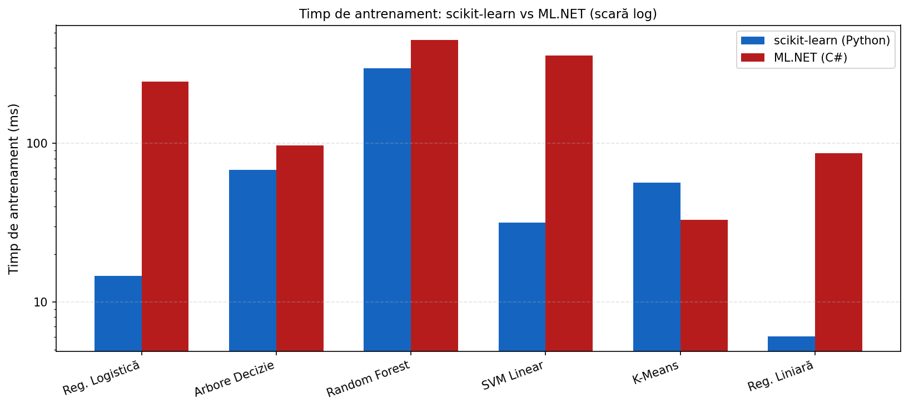
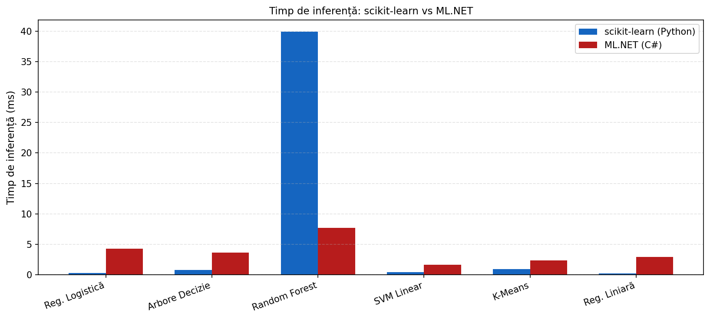
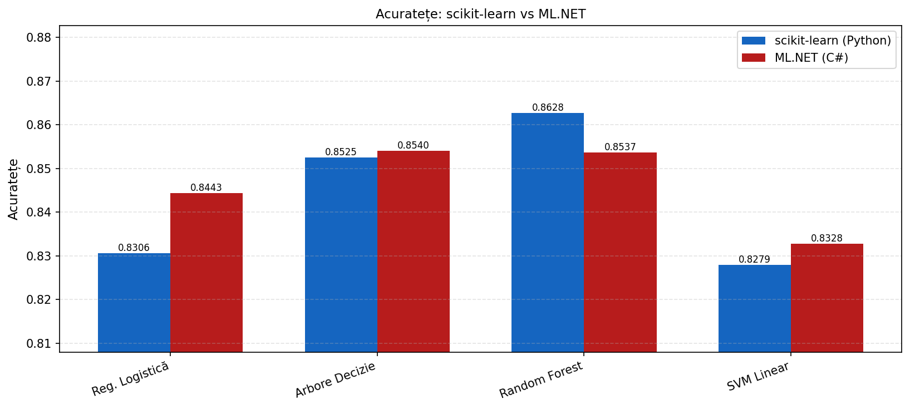
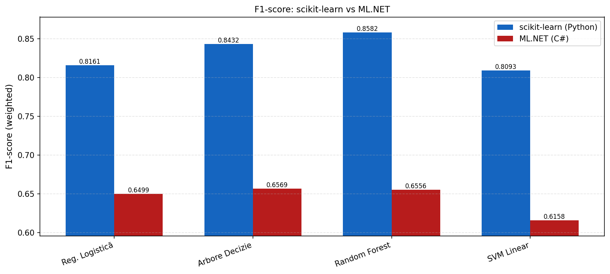
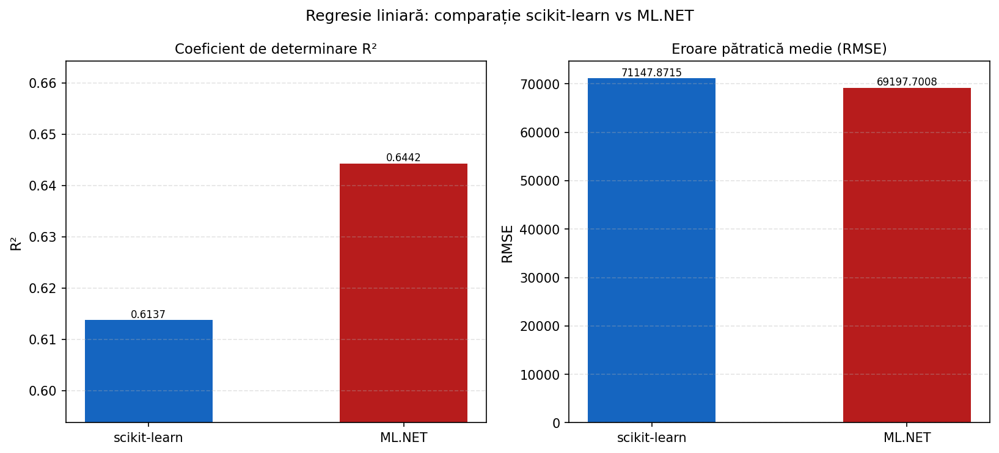

# Benchmark scikit-learn vs ML.NET

Benchmark reproductibil care compară **scikit-learn (Python)** și **ML.NET (C# / .NET 8)** pe aceleași două seturi de date Kaggle, rulând cele **6 algoritmi** și producând două fișiere JSON cu schemă identică, plus 5 grafice comparative.

## Algoritmi comparați

| Categorie | scikit-learn | ML.NET | Cheie JSON |
|---|---|---|---|
| Clasificare | `LogisticRegression` | `LbfgsLogisticRegression` | `LogisticRegression` |
| Clasificare | `DecisionTreeClassifier` | `FastTree` (1 tree, 31 leaves) | `DecisionTree` |
| Clasificare | `RandomForestClassifier` | `FastForest` (100 trees) | `RandomForest` |
| Clasificare | `LinearSVC` | `LinearSvm` | `SVM_Linear` |
| Clustering | `MiniBatchKMeans` | `KMeans` (3 clusters) | `KMeans` |
| Regresie | `LinearRegression` | `Sdca` regressor | `LinearRegression` |

Fiecare algoritm este cronometrat cu **mediana a 5 rulări** (`time.perf_counter` în Python, `Stopwatch` în C#).

## Seturi de date

| Fișier | Dataset Kaggle | Folosit pentru |
|---|---|---|
| `data/adult.csv` | `uciml/adult-census-income` | clasificare + clustering |
| `data/housing.csv` | `camnugent/california-housing-prices` | regresie |

Descarcă-le cu CLI-ul Kaggle (din rădăcina repo-ului):

```bash
kaggle datasets download -d uciml/adult-census-income -p data --unzip
kaggle datasets download -d camnugent/california-housing-prices -p data --unzip
```

## Structura proiectului

```
Articol - Copie/
├── data/                       # CSV-urile Kaggle (adult.csv, housing.csv)
├── charts/                     # 5 grafice PNG generate de generate_charts.py
├── MLNetBenchmark/             # Proiect .NET 8 (benchmark ML.NET)
│   ├── Program.cs              # pipeline + benchmark + scriere results_mlnet.json
│   ├── Models.cs               # POCO-uri pentru LoadFromTextFile
│   ├── MLNetBenchmark.csproj   # referințe NuGet (Microsoft.ML 3.0.1)
│   └── README.md               # detalii specifice ML.NET
├── experiments_sklearn.py      # benchmark scikit-learn → results_sklearn.json
├── generate_charts.py          # 5 grafice PNG din cele două JSON-uri
├── requirements.txt            # dependențe Python
├── results_sklearn.json        # output benchmark Python
├── results_mlnet.json          # output benchmark .NET
└── README.md                   # acest fișier
```

## Prerechizite

- **Python 3.10+**
- **.NET 8 SDK** — [download](https://dotnet.microsoft.com/en-us/download/dotnet/8.0)
- Cele două CSV-uri Kaggle plasate în `data/`

La prima compilare, `dotnet` descarcă pachetele NuGet `Microsoft.ML` și `Microsoft.ML.FastTree` (versiunea `3.0.1`).

## Instalare

### 1. Clonează repo-ul și instalează dependențele Python

```powershell
git clone <repo-url>
cd "Articol - Copie"

pip install -r requirements.txt
```

### 2. Restaurează pachetele .NET

```powershell
dotnet restore MLNetBenchmark/MLNetBenchmark.csproj
```

## Comenzi de rulare

Rulează cele trei etape **în ordinea de mai jos** (graficele depind de ambele fișiere JSON):

```powershell
# 1) Benchmark scikit-learn → results_sklearn.json
python experiments_sklearn.py

# 2) Benchmark ML.NET → results_mlnet.json
cd MLNetBenchmark
dotnet run -c Release
cd ..

# 3) Generează cele 5 grafice PNG
python generate_charts.py
```

### Comenzi utile suplimentare

```powershell
# Build doar (fără rulare) pentru proiectul .NET
dotnet build MLNetBenchmark/MLNetBenchmark.csproj -c Release

# Curăță artefactele de build .NET
dotnet clean MLNetBenchmark/MLNetBenchmark.csproj

# Rulează direct executabilul .NET după build (din rădăcina repo-ului)
MLNetBenchmark\bin\Release\net8.0\MLNetBenchmark.exe
```

## Output

### Fișiere JSON cu schemă identică

Atât `results_sklearn.json` cât și `results_mlnet.json` au exact aceeași structură, ca să poată fi încărcate simetric de `generate_charts.py`:

```json
{
  "LogisticRegression": { "train_ms": ..., "infer_ms": ..., "Accuracy": ..., "F1": ..., "Precision": ..., "Recall": ..., "ROC_AUC": ... },
  "DecisionTree":       { "train_ms": ..., "infer_ms": ..., "Accuracy": ..., "F1": ..., "Precision": ..., "Recall": ..., "ROC_AUC": ... },
  "RandomForest":       { "train_ms": ..., "infer_ms": ..., "Accuracy": ..., "F1": ..., "Precision": ..., "Recall": ..., "ROC_AUC": ... },
  "SVM_Linear":         { "train_ms": ..., "infer_ms": ..., "Accuracy": ..., "F1": ..., "Precision": ..., "Recall": ..., "ROC_AUC": ... },
  "KMeans":             { "train_ms": ..., "infer_ms": ..., "Silhouette": ..., "Inertia": ... },
  "LinearRegression":   { "train_ms": ..., "infer_ms": ..., "R2": ..., "RMSE": ..., "MAE": ... }
}
```

### Cele 5 grafice generate

Toate graficele sunt salvate în folderul `charts/`.

#### 1. Timp de antrenament (scară logaritmică pe Y)



#### 2. Timp de inferență (scară liniară)



#### 3. Acuratețe — 4 clasificatori (Y zoomed, valori adnotate)



#### 4. F1-score weighted — 4 clasificatori (Y zoomed, valori adnotate)



#### 5. Regresie liniară — R² și RMSE



## Note despre benchmark

- **Mediana a 5 rulări** absoarbe costul JIT/warm-up fără să elimine prima măsurătoare.
- **Preprocesare excluse din timpii pe algoritm** — `StandardScaler` (sklearn) și `OneHotEncoding + NormalizeMinMax` (ML.NET) sunt fitate o singură dată pe trainset, înainte de cronometrare.
- **Cache** — în ML.NET, view-urile transformate sunt cache-uite cu `mlContext.Data.Cache(...)` ca rulările repetate să citească din memorie.
- **Encoding asimetric (intenționat)** — sklearn folosește `OrdinalEncoder` (etichete întregi), iar ML.NET folosește `OneHotEncoding` (vectori indicatori). Asta explică diferențele între clasificatorii liniari (`LogisticRegression`, `LinearSvm`).
- **K-Means metric mapping** — ML.NET nu expune silhouette score, așa că în JSON-ul ML.NET `Silhouette` ← `DaviesBouldinIndex` și `Inertia` ← `AverageDistance`. Graficele plotează doar `train_ms` / `infer_ms` pentru K-Means, deci maparea afectează doar JSON-ul brut.

## Reproductibilitate

- `RANDOM_STATE = 42` în Python; `seed: 42` la `TrainTestSplit` în ML.NET.
- `TEST_SIZE = 0.2` în ambele ecosisteme.
- `N_RUNS = 5` cu raportarea medianei.

## Troubleshooting

- **`FileNotFoundError: data/adult.csv`** — descarcă datasetul Kaggle (vezi secțiunea *Seturi de date*).
- **`Missing results_sklearn.json` la `generate_charts.py`** — rulează întâi `python experiments_sklearn.py`.
- **`Missing results_mlnet.json` la `generate_charts.py`** — rulează întâi `dotnet run -c Release` din `MLNetBenchmark/`.
- **Eroare NuGet la primul build** — verifică conexiunea la internet și rulează `dotnet restore MLNetBenchmark/MLNetBenchmark.csproj`.

## Vezi și

- [`MLNetBenchmark/README.md`](MLNetBenchmark/README.md) — detalii despre pipeline-ul ML.NET, pre-curățarea CSV-urilor și hyperparametrii fiecărui trainer.
